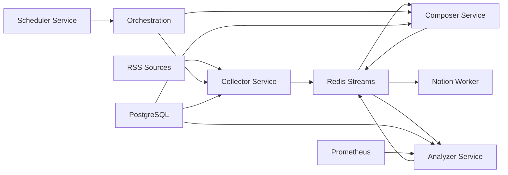

# RaveDigest – AI-Powered Content Digest Platform
[](https://github.com/Skateslavasker/Ravedigest/actions/workflows/docker.yml)
[](LICENSE)
[](https://www.python.org/downloads/)

**RaveDigest** is an enterprise-grade microservices platform that automatically collects, analyzes, and curates trending content using advanced AI technologies. The system intelligently filters developer-focused articles, provides AI-powered summaries, and publishes structured digests to Notion databases.

## 🏗️ Architecture Overview

RaveDigest implements a modern event-driven microservices architecture with the following core components:



### Services Architecture

| Service | Port | Purpose | Key Technologies | Recent Fixes |
|---------|------|---------|------------------|--------------|
| **Collector** | 8001 | RSS feed collection & deduplication | FastAPI, BeautifulSoup, Redis | ✅ Fixed NoneType errors, UUID serialization |
| **Analyzer** | 8002 | Content extraction & AI analysis | OpenAI GPT, Prometheus, Scikit-learn | ✅ Health checks, dependency updates |
| **Composer** | 8003 | Digest generation & formatting | Jinja2, FastAPI | ✅ Docker health checks with curl |
| **Notion Worker** | 8004 | Notion database publishing | Notion API, Markdown parsing | ✅ Fixed text length validation (2000 char limit) |
| **Scheduler** | 8005 | Workflow orchestration & automation | Schedule, Tenacity | ✅ Fixed dependency naming, environment config |

## 🚀 Quick Start

### Prerequisites

- **Docker** & **Docker Compose** (v2.0+)
- **Python** 3.12+ (for local development)
- **Make** (optional, for convenience commands)

### Environment Setup

1. **Clone the repository:**
   ```bash
   git clone https://github.com/Skateslavasker/Ravedigest.git
   cd Ravedigest
   ```

2. **Configure environment variables:**
   ```bash
   cp .env.example .env
   # Edit .env with your actual API keys and configuration
   # NEVER commit the .env file - it's protected by .gitignore
   ```

3. **Required API Keys:**
   - **OpenAI API Key**: For content analysis and summarization
   - **Notion API Key**: For publishing digests
   - **Notion Database ID**: Target database for digest publishing
   - **See SECURITY.md** for detailed setup instructions and best practices

### Deployment Options

#### Docker Compose (Recommended)

```bash
# Start all services
make up

# View logs
make logs

# Stop services
make down
```

#### Manual Docker Deployment

```bash
# Start infrastructure
docker-compose up -d postgres redis

# Build and start services
docker-compose up --build -d

# Health check
curl http://localhost:8001/collector/health
curl http://localhost:8002/analyzer/health
```

## 🔧 Configuration

### Environment Variables

#### Database Configuration
```bash
POSTGRES_USER=postgres
POSTGRES_PASSWORD=your_secure_password
POSTGRES_DB=digest_db
POSTGRES_HOST=postgres
POSTGRES_PORT=5432
```

#### Redis Configuration
```bash
REDIS_URL=redis://redis:6379/0
REDIS_HOST=redis
REDIS_PORT=6379
REDIS_DB=0
```

#### AI & External Services
```bash
OPENAI_API_KEY=sk-your-openai-key
OPENAI_MODEL=gpt-4o-mini
NOTION_API_KEY=ntn_your-notion-key
NOTION_DB_ID=your-database-id
```

#### Service URLs (Internal)
```bash
COLLECTOR_URL=http://collector:8001
ANALYZER_URL=http://analyzer:8002
COMPOSER_URL=http://composer:8003
NOTION_WORKER_URL=http://notion-worker:8004
```

### RSS Feed Configuration

RSS feeds are configured in `shared/config/settings.py`:

```python
class ServiceSettings(AppBaseSettings):
    rss_feeds: List[str] = Field(
        default=[
            "https://feeds.feedburner.com/oreilly/radar",
            "https://techcrunch.com/feed/",
            "https://www.wired.com/feed/rss",
            # Add your feeds here
        ]
    )
```

## 📊 Monitoring & Observability

### Health Checks

Each service exposes standardized health endpoints:

```bash
# Comprehensive health check
GET /service-name/health

# Liveness probe
GET /service-name/health/live

# Readiness probe
GET /service-name/health/ready
```

### Prometheus Metrics

The Analyzer service exposes Prometheus metrics:

```bash
# Metrics endpoint
GET http://localhost:8002/analyzer/metrics

# Sample metrics
analyzer_article_processed_total 142.0
```

### Service Status Monitoring

Check processing status for orchestration:

```bash
# Analyzer processing status
GET /analyzer/status

# Notion Worker processing status
GET /notion/status
```

## 🔄 Workflow & Data Flow

### Daily Automated Workflow

The Scheduler service orchestrates a fully automated daily workflow:

1. **03:50 AM**: Trigger RSS collection (configurable via `SCHEDULER_DAILY_TIME`)
2. **Wait**: For analyzer to process all articles with status monitoring
3. **Auto-trigger**: Composer service for digest generation
4. **Wait**: For Notion Worker to publish digest with retry logic
5. **Complete**: Workflow with full observability and error handling

### Data Processing Pipeline

```
RSS Feeds → Raw Articles → Content Extraction → AI Analysis → Digest Generation → Notion Publishing
```

#### Data Models

**Raw Article:**
```json
{
  "title": "Article Title",
  "url": "https://example.com/article",
  "published": "2024-01-15T10:00:00Z",
  "source": "TechCrunch",
  "summary": "Initial summary"
}
```

**Enriched Article:**
```json
{
  "title": "Article Title",
  "url": "https://example.com/article",
  "published": "2024-01-15T10:00:00Z",
  "source": "TechCrunch",
  "summary": "AI-generated summary",
  "relevance_score": 8.5,
  "developer_focus": true
}
```

## 🛠️ Development

### CI/CD Pipeline

RaveDigest includes a comprehensive CI/CD pipeline with GitHub Actions:

#### Automated Testing
- **Multi-service testing** with proper dependency management
- **Service-specific PYTHONPATH** configuration for different directory structures
- **Shared module validation** to ensure cross-service compatibility
- **Parallel test execution** for faster feedback

#### Code Quality
- **Code formatting** with Black (PEP 8 compliance)
- **Import sorting** with isort
- **Linting** with flake8 for code quality
- **Type checking** support for better code reliability

#### Security Scanning
- **Dependency vulnerabilities** with safety
- **Security issues** with bandit static analysis
- **Secret detection** to prevent credential leaks
- **Automated security updates** via Dependabot

#### Environment Management
- **GitHub Secrets** for secure API key management
- **Environment templates** with `.env.example`
- **Test environment isolation** with mock services
- **Production-ready deployment** configurations

### Local Development Setup

1. **Install dependencies:**
   ```bash
   pip install -r services/collector/requirements.txt
   pip install -r services/analyzer/requirements.txt
   # Repeat for all services
   ```

2. **Set up pre-commit hooks:**
   ```bash
   pip install pre-commit
   pre-commit install
   ```

3. **Code formatting:**
   ```bash
   make format  # Runs black on services/ and shared/
   ```

### Testing

Each service includes comprehensive test suites with service-specific configurations:

```bash
# Install all dependencies first (recommended)
pip install -r services/collector/requirements.txt
pip install -r services/analyzer/requirements.txt
pip install -r services/composer/requirements.txt
pip install -r services/notion_worker/requirements.txt
pip install -r services/scheduler/requirements.txt

# Service-specific testing (note different PYTHONPATH requirements)
# Collector service (src/collector structure)
cd services/collector && PYTHONPATH=src:../.. pytest tests -v

# Analyzer service (root structure)
cd services/analyzer && PYTHONPATH=.:../.. pytest tests -v

# Composer service (app/ structure)
cd services/composer && PYTHONPATH=.:../.. pytest tests -v

# Notion Worker service (app/ structure)
cd services/notion_worker && PYTHONPATH=.:../.. pytest tests -v

# Scheduler service (src/ structure)
cd services/scheduler && PYTHONPATH=.:../.. pytest tests -v

# Run via GitHub Actions CI (recommended)
# Push to trigger automated testing with proper environment
```

### Database Migrations

Using Alembic for database schema management:

```bash
# Create migration
cd shared
alembic revision --autogenerate -m "description"

# Apply migrations
alembic upgrade head

# Migration history
alembic history
```

## 🏢 Production Deployment

### Docker Swarm

```yaml
# docker-stack.yml
version: '3.8'
services:
  postgres:
    image: postgres:15
    deploy:
      replicas: 1
      resources:
        limits:
          memory: 1G
        reservations:
          memory: 512M

  collector:
    image: ravedigest/collector:latest
    deploy:
      replicas: 2
      update_config:
        parallelism: 1
        delay: 10s
```

### Kubernetes

```yaml
apiVersion: apps/v1
kind: Deployment
metadata:
  name: ravedigest-collector
spec:
  replicas: 3
  selector:
    matchLabels:
      app: collector
  template:
    metadata:
      labels:
        app: collector
    spec:
      containers:
      - name: collector
        image: ravedigest/collector:latest
        ports:
        - containerPort: 8001
        env:
        - name: POSTGRES_URL
          valueFrom:
            secretKeyRef:
              name: ravedigest-secrets
              key: postgres-url
```

### Environment-Specific Configuration

#### Production `.env`
```bash
# Security
LOCAL_DEV=false
POSTGRES_PASSWORD=complex_secure_password

# Performance
REDIS_MAX_CONNECTIONS=100
POSTGRES_POOL_SIZE=20

# Monitoring
SENTRY_DSN=https://your-sentry-dsn
LOG_LEVEL=INFO
```

#### Staging `.env`
```bash
LOCAL_DEV=false
LOG_LEVEL=DEBUG
OPENAI_MODEL=gpt-3.5-turbo  # Cost optimization
```

## 📈 Performance & Scaling

### Horizontal Scaling

Services are designed for horizontal scaling:

- **Stateless services**: All services maintain no local state
- **Redis Streams**: Built-in consumer group load balancing
- **Database connections**: Managed via connection pooling
- **Health checks**: Ready for load balancer integration

### Performance Metrics

| Metric | Target | Monitoring |
|--------|--------|------------|
| Article processing time | <30s per article | Prometheus |
| API response time | <200ms | Health checks |
| Memory usage | <512MB per service | Docker stats |
| Database connections | <50 per service | PostgreSQL logs |

### Optimization Strategies

1. **Caching**: Redis-based deduplication and caching
2. **Async Processing**: FastAPI async/await throughout
3. **Connection Pooling**: SQLAlchemy connection pooling
4. **Retry Logic**: Exponential backoff with `@async_retry`
5. **Stream Processing**: Redis Streams for event handling

## 🔒 Security

### Security Features

- **Environment-based secrets management** with `.env.example` template
- **GitHub Secrets integration** for CI/CD and production deployments
- **Input validation** with Pydantic models and type safety
- **SQL injection protection** via SQLAlchemy ORM
- **Rate limiting** capabilities (configurable)
- **Health check authentication** (optional)
- **Automated security scanning** with bandit and safety in CI
- **Dependency vulnerability monitoring** via GitHub Dependabot

## 🚨 Troubleshooting

### Recent Fixes & Known Issues ✅

#### Recently Fixed Issues
- **NoneType Redis errors**: Fixed UUID serialization in collector service (`shared/utils/redis_client.py`)
- **Notion API validation**: Fixed 2000 character limit in text blocks (`services/notion_worker/app/markdown_parser.py`)
- **Docker health checks**: Added curl installation for health check commands in all Dockerfiles
- **Dependency conflicts**: Fixed pydantic-settings naming inconsistency in scheduler service
- **Database initialization**: Fixed table creation with `checkfirst=True` parameter

### Common Issues

#### Database Connection Issues
```bash
# Check database health
curl http://localhost:8001/collector/health

# Verify environment variables
docker-compose exec collector env | grep POSTGRES

# Check logs
docker-compose logs postgres collector
```

#### Redis Connection Issues
```bash
# Test Redis connectivity
docker-compose exec redis redis-cli ping

# Check stream status
docker-compose exec redis redis-cli XINFO GROUPS raw_articles
```

#### Service Communication Issues
```bash
# Verify service discovery
docker-compose exec collector nslookup analyzer

# Test internal APIs
docker-compose exec collector curl http://analyzer:8002/analyzer/health
```

### Log Analysis

```bash
# Follow all service logs
make logs

# Service-specific logs
docker-compose logs -f collector
docker-compose logs -f analyzer

# Search logs for errors
docker-compose logs | grep ERROR
```

### Performance Debugging

```bash
# Check resource usage
docker stats

# Analyze slow queries
docker-compose logs postgres | grep "slow query"

# Monitor Redis performance
docker-compose exec redis redis-cli --latency
```

## 🤝 Contributing

We welcome contributions! Please see our [Contributing Guidelines](CONTRIBUTING.md) for details.

### Development Workflow

1. **Fork** the repository
2. **Create** a feature branch (`git checkout -b feature/amazing-feature`)
3. **Make** your changes with appropriate tests
4. **Run** the test suite locally (see Testing section above)
5. **Format** code (`make format` or use CI formatting)
6. **Commit** changes (`git commit -m 'Add amazing feature'`)
7. **Push** to branch (`git push origin feature/amazing-feature`)
8. **Create** a Pull Request (CI will automatically run all checks)

**Note**: All pull requests must pass the CI pipeline (tests, linting, security scans) before merging.

### Code Standards

- **Python**: PEP 8 compliance via Black
- **Docstrings**: Google-style docstrings
- **Type hints**: Full type annotation coverage
- **Tests**: Minimum 80% code coverage
- **Commits**: Conventional commit format

## 📄 License

This project is licensed under the MIT License - see the [LICENSE](LICENSE) file for details.

## 🔗 Related Projects

- [Notion API Python Client](https://github.com/ramnes/notion-sdk-py)
- [FastAPI](https://github.com/tiangolo/fastapi)
- [Redis Streams](https://redis.io/topics/streams-intro)
- [OpenAI Python Library](https://github.com/openai/openai-python)

## 📞 Support

- **Issues**: [GitHub Issues](https://github.com/Skateslavasker/Ravedigest/issues)
- **Discussions**: [GitHub Discussions](https://github.com/Skateslavasker/Ravedigest/discussions)
- **Email**: revanthnaik12@gmail.com

---

*RaveDigest helps you stay updated with the latest tech trends without the noise.*
